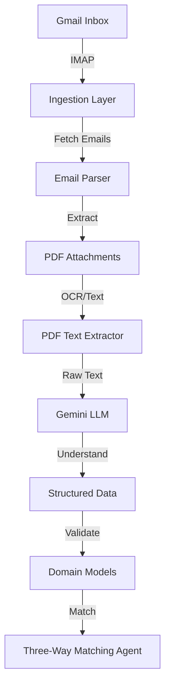

# 📦 AI Agent for Automated Invoice Processing (Three-Way Matching)

An end-to-end **AI Agent MVP** that automates invoice processing by reading real emails from Gmail, extracting PDF invoices, understanding them using a Gemini-powered LLM, and preparing structured data for three-way matching against Purchase Orders (PO) and Goods Receipts (GRN).

This is **not a demo** or dummy-data project — the system works on **real emails and real invoices**.

---

## 🚨 Problem Statement

In modern supply chains and finance teams, invoice processing is slow and error-prone:

- Invoices arrive via email as PDF attachments
- Finance teams manually download PDFs
- Extract invoice details by hand
- Cross-check invoices with Purchase Orders and Goods Receipts
- Decide whether to approve, flag, or reject payments

This workflow:
- Does not scale
- Is highly manual
- Is vulnerable to human error
- Delays payments and reconciliation

---

## 💡 Solution Overview

We built an **AI Agent** that automates this entire workflow:

> 📧 Email → 📄 PDF → 🧠 AI Understanding → ✅ Structured Output

The agent:
1. Connects to a real Gmail inbox using secure IMAP
2. Fetches unread emails
3. Extracts PDF invoice attachments
4. Converts PDFs into raw text
5. Uses **Gemini LLM** to extract structured invoice data
6. Validates outputs using strict domain models
7. Produces confidence scores and reasoning to prevent hallucinations

---

## 🤖 Why This Is a Real AI Agent

This system follows a **Perceive → Reason → Act** agent architecture:

### 🔍 Perception
- Reads real emails from Gmail
- Extracts real PDF attachments

### 🧠 Reasoning
- Uses a Gemini-powered LLM to understand invoice content
- Applies validation rules and confidence thresholds
- Avoids guessing or hallucinating missing fields

### ⚙️ Action
- Produces structured invoice data
- Flags low-confidence or invalid extractions
- Prepares data for downstream three-way matching

---

## 🏗️ Architecture Overview



---

## 🧱 Project Structure

```
app/
├── core/                   # Configuration & settings
├── ingestion/              # Gmail + email parsing
│   ├── gmail_client.py
│   └── email_parser.py
├── pdf/                    # PDF handling
│   └── pdf_text_extractor.py
├── services/               # AI logic
│   ├── gemini_client.py
│   └── invoice_extractor.py
├── models/                 # Domain models (Invoice, MatchResult, etc.)
├── agents/                 # Reasoning agents (three-way matching)
├── main.py                 # FastAPI entrypoint
scripts/
├── verify_gmail.py
├── verify_pdf_extraction.py
└── verify_invoice_extraction.py
```

---

## 🔐 Environment & Secrets Management

All secrets are managed via `.env` (never committed):

```env
SECRET_KEY=
LLM_API_KEY=
GEMINI_API_KEY=

EMAIL_USER=your_email@gmail.com
EMAIL_PASSWORD=your_gmail_app_password
```

`.env.example` is provided for reference.

---

## 🛡️ Responsible AI & Guardrails
We designed the AI system with safety and reliability in mind:

- **Strict JSON-only LLM outputs**
- **No guessing**: missing fields are returned as null
- **Confidence scoring (0–1)** required for every extraction
- **Domain model validation** using Pydantic
- **Fail-safe behavior**: low-confidence outputs are flagged, not auto-approved

The agent never blindly trusts the LLM.

---

## 🚀 How to Run Locally

1️⃣ **Create & activate virtual environment**
```bash
python -m venv .venv
.venv\Scripts\Activate
```

2️⃣ **Install dependencies**
```bash
pip install -r requirements.txt
```

3️⃣ **Configure environment**
```bash
cp .env.example .env
# Fill in required values
```

4️⃣ **Run the backend**
```bash
python -m uvicorn app.main:app --reload
```
Visit: http://127.0.0.1:8000/docs

---

## 🧪 Verification Scripts
We include real verification scripts to prove end-to-end functionality:

- `verify_gmail.py` → Gmail IMAP connectivity
- `verify_pdf_extraction.py` → PDF extraction from emails
- `verify_invoice_extraction.py` → Gemini-based invoice understanding

---

## 📈 Business Impact
- Reduces invoice processing time from hours to minutes
- Eliminates manual PDF handling
- Scales without increasing finance headcount
- Improves accuracy and auditability

---

## 🧭 Roadmap (Next Steps)
- Three-way matching (Invoice × PO × GRN)
- Human-in-the-loop review for flagged invoices
- ERP integrations
- Multi-inbox / multi-tenant support
